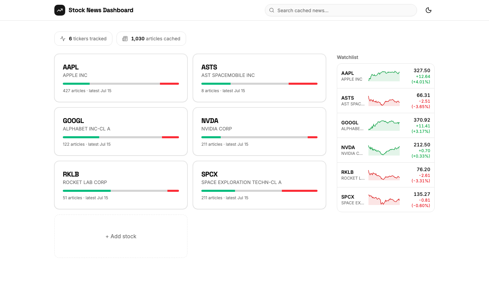
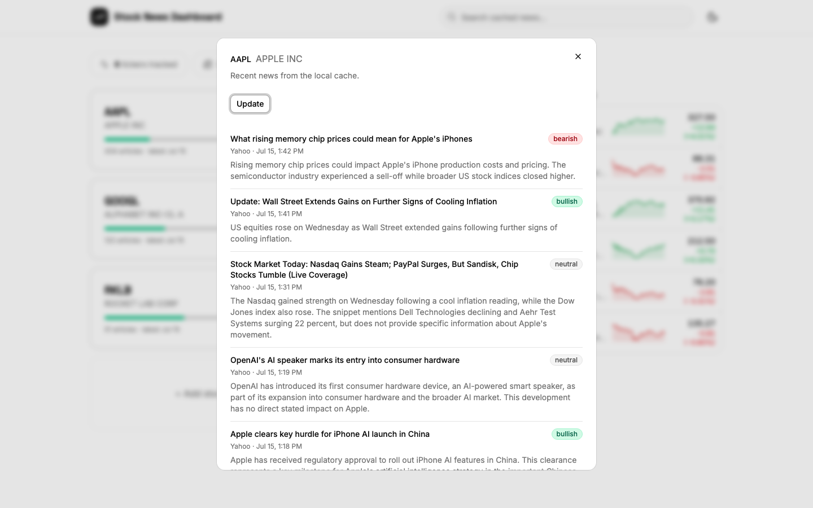
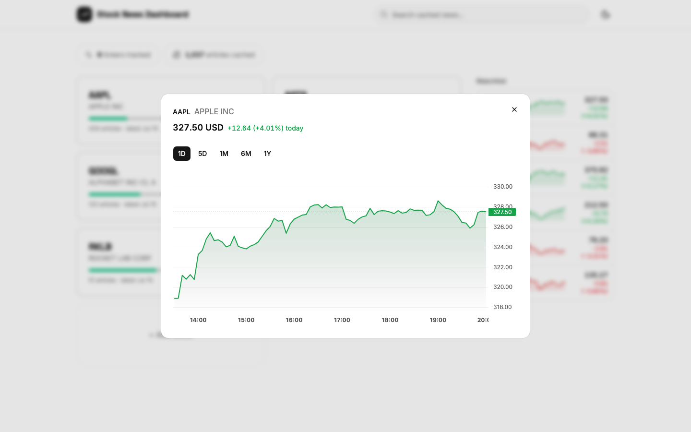
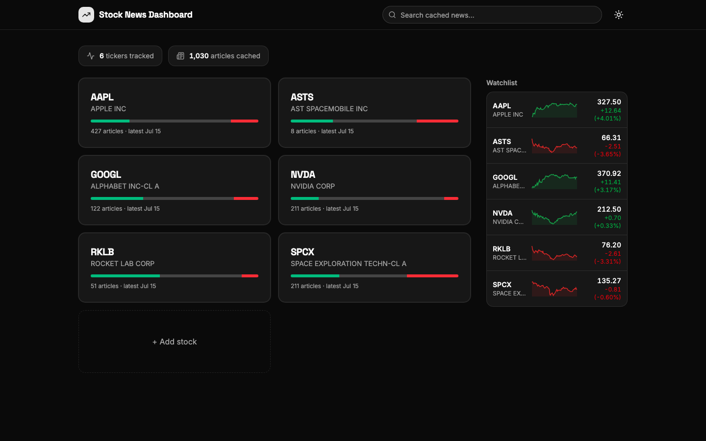
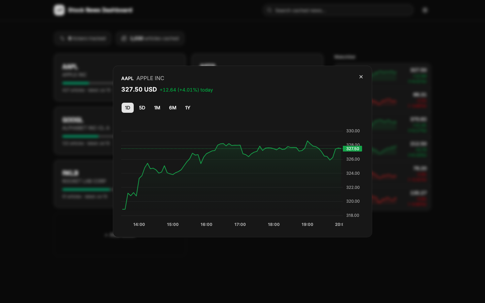

# Stock News Dashboard

A single-user dashboard for tracking company news across a personal watchlist of
stock tickers. Every article is summarized and sentiment-tagged by AI at ingestion,
cached locally in SQLite, and searchable full-text. Live prices and interactive
charts sit alongside the news.



**Stock news panel** with AI summaries and sentiment tags:



**Interactive price chart** with selectable ranges:



<details>
<summary>Dark mode</summary>




</details>

## What it does

- **Watchlist of stock blocks.** Add a ticker through a typeahead search (validated
  against Finnhub before it is accepted, duplicates rejected). Each stock is a card
  showing article count, latest article date, and a sentiment distribution bar
  (bullish / neutral / bearish share of its cached articles).
- **News panel.** Click a card to see that stock's recent news: headline (linking
  out to the original source), source, timestamp, an AI-written summary, and a
  sentiment tag. An update button fetches fresh news on demand.
- **AI enrichment.** Every new article gets one Claude call (Haiku) at ingestion
  that produces a short factual summary and a bullish / bearish / neutral tag.
  Enrichment runs in a background worker pool, so adding a stock returns in under
  a second while summaries fill in over the following seconds.
- **Full-text search.** The top search bar queries every cached article (headlines
  and AI summaries) through SQLite FTS5. Results are instant and entirely local.
- **Prices and charts.** A sidebar lists every watchlist stock with an intraday
  sparkline, current price, and day change. Clicking opens an interactive chart
  (crosshair, zoom, pan) with 1D / 5D / 1M / 6M / 1Y ranges.
- **Morning refresh.** On the first dashboard load of each new market day, every
  watchlist ticker is refreshed automatically before rendering. No cron needed.
- **Light and dark mode**, persisted, defaulting to the system preference.

## Architecture

```
React + Vite + Tailwind + shadcn/ui          FastAPI (Python)
┌──────────────────────────────┐    proxy    ┌─────────────────────────────┐
│  watchlist grid · news panel │ ──────────► │  routes (main.py)           │
│  search bar · sidebar charts │             │  ingest → dedupe → store    │
└──────────────────────────────┘             │  background AI enrichment   │
                                             │  refresh logic + TTL guard  │
                                             └──────┬──────────────────────┘
                                                    │
              ┌────────────┬────────────────┬───────┴──────┐
              ▼            ▼                ▼              ▼
          Finnhub      Anthropic        Yahoo chart     SQLite
       (news, symbol   (summary +       API (price      (articles cache,
        validation)    sentiment)       history)        FTS5, watchlist)
```

Key design decisions (the full rationale lives in [CLAUDE.md](CLAUDE.md)):

- **News is surfaced and linked, never scraped.** Headlines and metadata come from
  Finnhub; the dashboard always links out to the original article.
- **Read path never calls external APIs.** Opening a panel or searching reads only
  SQLite. External calls happen on ingestion (morning refresh, update button, add).
- **Articles are deduped by URL** with idempotent inserts, so overlapping fetch
  windows cost nothing.
- **AI runs once per unique article, asynchronously.** Cost is bounded by unique
  articles, not views. A failed AI call leaves null fields and never blocks caching.
- **Refresh on first load instead of cron**, because a local app is not guaranteed
  to be running at market open.
- **A short TTL guards the update button**, so repeated clicks serve cache instead
  of draining API quota.

## Getting started

Prerequisites: Python 3.11+, Node 20+, a free [Finnhub](https://finnhub.io) API key,
and an [Anthropic](https://platform.claude.com) API key.

### Backend

```bash
cd backend
python3 -m venv .venv
.venv/bin/pip install -r requirements.txt
cp .env.example .env        # then fill in FINNHUB_API_KEY and ANTHROPIC_API_KEY
.venv/bin/uvicorn app.main:app --reload
```

The API runs on http://localhost:8000. The SQLite database is created automatically
on first startup. `GET /health` reports any missing API keys.

### Frontend

```bash
cd frontend
npm install
npm run dev
```

Open http://localhost:5173. The dev server proxies API calls to the backend, so no
CORS setup is needed.

### Tests

```bash
cd backend
.venv/bin/pytest
```

The test suite (59 tests) mocks all external APIs and never touches the network.

## API

| Method | Path | Description |
|---|---|---|
| `GET` | `/health` | Health check, reports missing API keys |
| `GET` | `/stocks` | Watchlist with article and sentiment counts (triggers the new-market-day refresh) |
| `POST` | `/stocks` | Validate a ticker, add it, fetch its news |
| `DELETE` | `/stocks/{ticker}` | Remove a stock and its cached articles |
| `GET` | `/stocks/{ticker}/news` | Cached articles for one stock (local only) |
| `POST` | `/stocks/{ticker}/refresh` | On-demand news fetch, TTL-guarded |
| `GET` | `/stocks/{ticker}/prices?range=` | Price series (`1d`, `5d`, `1mo`, `6mo`, `1y`) |
| `GET` | `/symbols?q=` | Ticker typeahead suggestions |
| `GET` | `/search?q=` | Full-text search across all cached articles |

## Project structure

```
backend/
  app/
    main.py            FastAPI app and routes
    db.py              SQLite connection and schema (WAL mode, FTS5 + sync triggers)
    finnhub_client.py  Symbol search and company news
    prices.py          Price history (Yahoo chart API, cached)
    ai.py              Claude summary + sentiment (structured JSON output)
    enrich.py          Background enrichment worker pool
    ingest.py          Fetch, dedupe by URL, store, queue enrichment
    refresh.py         Morning refresh and per-ticker TTL refresh
  tests/               59 tests, all external APIs mocked
frontend/
  src/
    App.tsx            Layout, watchlist grid, search
    components/        News panel, chart panel, sidebar, add dialog, theme toggle
    lib/api.ts         Typed API client
docs/                  Screenshots
CLAUDE.md              Project context and decision log
```

## Data model

SQLite with four tables: `watchlist`, `articles` (unique on `url`, cascade delete
with the watchlist), `articles_fts` (FTS5 over headline + summary, kept in sync by
triggers), and `meta` (refresh timestamps). WAL mode lets background enrichment
writers coexist with request reads.

## Roadmap

- **Semantic search.** Embed articles at ingestion and serve vector similarity
  behind the same search bar (planned Phase 7).

## Non-goals

No accounts or multi-user support, no trading or portfolio features, and no
investment advice. The AI layer is a research and summarization assistant only.
